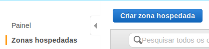

## Criação de dominio
Vamos usar o projeto
```sh
http://www.dot.tk/pt/index.html
```


Podemos ver que está disponivel nosso endereço
```sh
juliocesar.tk
```

Vamos clicar em **Obtê-lo agora!**.

Em seguida podemos ir em **Pagamento**.


Depois de clicar em pagamento vamos ser redirecionandos para


Em seguida vamos clicar em **Continue** e vamos ser redirecionandos para a seguinte pagina.


Podemos inserir o email ou se cadastrar com uma conta google. Vou inserir meu email **greenmind.sec@gmail.com** e clicar em **Verify My Email Address**.


Vamos ver no email a confirmação, vamos clicar no link que recebemos em seguida..


Depois vamos ser redirecionandos para a pagina de cadastro, vamos precisar inserir algumas informações, como:

- Nome
- Sobrenome
- Nome da empresa
- Endereço 1


Alem disso precisamos colocar
- Codigo postal
- Cidade
- Pais
- Estado
- Numero de telefone
- Email
- Senha
- Confirmar senha


> Não podemos esquecer de aceitar **I have read and agree to the Terms & Conditions**.


Em seguida vamos clicar em **Complete Order**.

Se der tudo certo vamos ser redirecionandos para a pagina **Order Confirmation**.

> Vamos clicar em **Click here to go to your Client Area** para sermos redirecionandos para a Area do cliente.

Vamos ser redirecionandos para a pagina de login


Vamos ser redirecionandos para a pagina de login com o DNS padrão.


## Configurando Route 53
> https://console.aws.amazon.com/route53/



Assim que clicar em **Criar zona hospedada** vai ser aberto uma aba do lado direito.


> Em seguida vamos clicar em **Criar**.

Vai ser retornado alguns DNS que vamos adicionar ao dominio


## Adicionando meu DNS


Em seguida vamos em **Manage Domain**.


Em seguida vamos até **Management Tools**.


Vamos agora mudar para **Use custom nameservers (enter below)**.


Vamos adicionar os DNS da amazon


Vai ficar Assim


Vai ficar assim


## Criando servidor
Foi pedido um servidor **CentOS7**, vamos usar a imagem.


Vamos clicar em **Continuar**.


Vamos selecionar **t2.micro**.


Vamos ver os detalhes das instancias


Vamos colocar 30 GB de HD


Vamos criar uma tag para ele


Vamos ver as regras disponiveis


Vamos revisar a instancia


Vamos criar uma nova key

> Vamos realizar o download dela

Em seguida só precisamos clicar em **Launch instances**.

### Acessando maquina
Com a chave em mãos vamos precisar dar pemissão a chave e por usarmos o centos vamos usar o usuario **centos**.

Vamos no diretorio da chave dar permissão **400** usando o chmod.
```sh
chmod 400 juliocesar-desafio1.pem
```

Antes de ter acesso a maquina


Deu tudo certo, agora vamos configurar um Elastic IP.

### Configurando Elastic IP
Vamos ir até o menu ao lado esquerdo no menu **Elastic IPs**.


Alocando novo IP

> Vamos clicar em **Allocate**.

Vai ser gerado um novo IP


Vamos agora **Associate**.


Podemos acessar usando
```sh
ssh -i "juliocesar-desafio1.pem" centos@ec2-3-213-226-214.compute-1.amazonaws.com
```

### Configurando infraestrutura
Vamos alterar para root.
```sh
sudo su
```

Vamos atualizar o sistema
```sh
yum update
```

Vamos instalar o **epel-release**.
```sh
yum -y install epel-release
```

Vamos instalar o nginx
```sh
yum -y install nginx
```

Vamos iniciar ele usando
```sh
systemctl start nginx
```

Em seguida vamos adicionar o nginx
```sh
systemctl enable nginx
```

Instalando o nano
```sh
yum install nano
```

Com tudo vamos entrar no nosso IP e vamos ter o retorno.


#### Site
